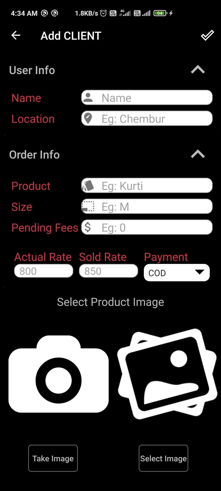

## Store-It
  Store It helps to keep the track of the sell products, the bussiness profit and dews of a client and all this can be done while being OFFLINE.
  
  ## About Store_it
  Store It  App is a multi-supported is multi-support sells tracker app for new business to keep track of sells. With this app you can instantly view a client and know all the product he/she brought , check for pending payments  of client, get date wise sort of when which product was brought and by whom, Know how much total profit you made with which client helped you generated highest profit. Easy solution to keep all your sells work flow smooth😊

 🔥You won't regret choosing this amazing Store It！
1. Save Client brought products. 🎬
2. Fully OFFLINE access anytime. ⌚
3. Check payment dews with a single click. ⌛
4. Get detail information of when a product was purchased and how. 🔥
5. Get date wise information of sales . ⚡
6. Know total profit your business made with just single click  ⚡

 # Features
 ## Main Dashboard
   
 
 When you enter the app home is empty, But you can add in clients to Maintain your track records with you OFFLINE which can be accessible 24/7.  In order to add them Click on the bottom button and that will lead you towards Adding new Client. 
 
## View Client Profile
  

User can get a quick glance on Client buy history and users own profit too, Also User can check for a particular product in client profile.
If any pending payments are there it will be notified, and if that product is return then user can also delete the product by simply long pressing on that product image and then deleting it.

 ## Backup-Restore 
 
One can take backup of the Data that is store in Store It app, and also retrieve the backup data any time. Here the backup data is Stored in users smarthphone, No data is collected by this aaplication.
Remmeber when backing up the data the previous backup data is deleted and replace with the new backup data which is the current stage of the app.

 
 ## Date Checks 
   
 
 User can keep track of which product is sold when and to whom by clicking on the date tab below besides the home tab, Here days are show in the circle and months and year are shown as text on screen.
 To view the product details user shoudl long press on a particular product name to view its details.
 
 ## Profit View
 
 
 User can check his/her overall business profit by clicking on the profit tab besides the date tab, here user can know from client did he/she earned maximum profit.
 
 ## Pending Payments
 
 
 User can know which client payment is remaning and according update or delete the product details. Here a list is shown with client who as maximum payment left to the lowest if any.
## ❗ Disclaimer:
❗ Store It  will not collect any personal or private information.  
❗ Store It is an independent one and is not affiliated with any 3rd Party.  
❗ Store It didn't use to clone or hack anything.  
